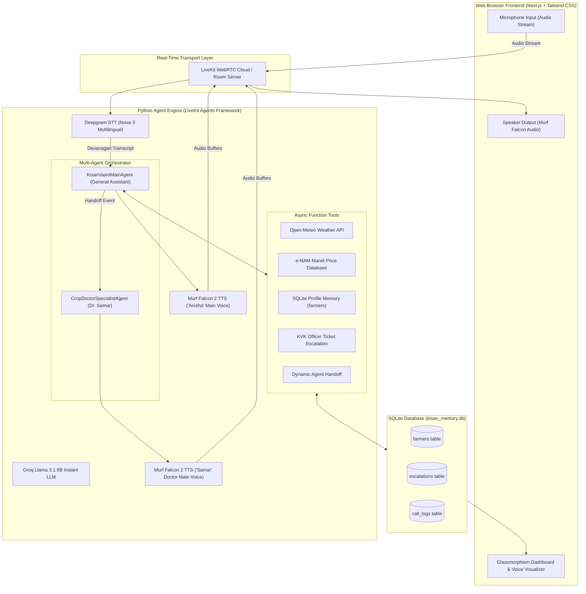

# Building Kisan Vaani: A Production-Grade Multi-Agent Voice AI Assistant for Indian Farmers 🇮🇳🌾

*Built during the 10 Days of AI Voice Agents Challenge — Voice for Bharat Edition powered by Murf Falcon 2 TTS & LiveKit.*

---

## 🌟 Introduction & Problem Statement

In rural India, millions of farmers rely on timely agricultural information — including daily commodity market (**mandi**) prices, localized weather forecasts, pest alerts, and expert agronomic advice. However, traditional mobile apps often fail due to:
- **Literacy & UI Barriers**: Complex navigation and text-heavy menus.
- **Language & Script Diversity**: Need for natural, conversational vernacular speech in local languages.
- **Urgent Field Emergencies**: Severe pest outbreaks (like Yellow Rust or Pink Bollworm) requiring immediate expert intervention.

To solve this, I built **Kisan Vaani (किसान वाणी)** — a real-time, multi-agent conversational AI voice assistant tailored for Indian farmers under the **Farm & Field Track**.

Driven by **Murf Falcon 2** (the fastest Text-to-Speech API with <100ms TTFB latency), **LiveKit WebRTC**, **Deepgram STT**, and **Groq Llama 3.1 LLM**, Kisan Vaani speaks directly with farmers in natural Devanagari Hindi, remembers caller facts across sessions, provides live API data, logs call analytics to SQLite, and seamlessly hands off high-risk crop disease consultations to a dedicated Specialist Agent (*Dr. Samar*).

---

## 🏗️ System Architecture & Real-Time Audio Flow

Below is the complete end-to-end architecture showing how low-latency audio and context flow through Kisan Vaani:



---

## 🛠️ Key Features Built Over 9 Days

### 1. Ultra-Low Latency Indian Voice (Days 1 & 2)
Integrated **Murf Falcon 2** (`Anisha` voice) paired with LiveKit WebRTC and Deepgram STT, delivering spoken responses with a **Time-To-First-Byte (TTFB) latency under 100ms**. The frontend features a dynamic audio visualizer showing real-time agent speech state.

### 2. Guardrails & Persistent Farmer Memory (Days 3 & 4)
- **Devanagari Script Enforcement**: Prompt guardrails strictly enforce responses in native Devanagari Hindi (नमस्ते, गेहूँ) and forbid raw code or XML tags.
- **SQLite Profile Storage**: Saved caller facts (name, district, crop type, irrigation) in SQLite (`farmers` table), allowing Kisan Vaani to remember returning callers (e.g., *Ramesh from Noida growing Wheat*).

### 3. Live Weather, Mandi Prices & Outbound Alerts (Days 5 & 6)
- **Real-Time Weather API**: Fetches current temperature, humidity, and rain probability using Open-Meteo geocoding.
- **e-NAM Mandi Price Lookup**: Returns real-time market prices per quintal for major Indian crops.
- **Proactive Alerts & Opt-Out**: Supports automated outbound alerts with an `opt_out_alerts` tool allowing farmers to unsubscribe anytime.

### 4. Human Escalation & Glassmorphism Analytics Dashboard (Days 7 & 8)
- **KVK Officer Ticket Creation**: When a complex dispute or severe disease occurs, the agent logs an emergency ticket in SQLite (`escalations` table) for a Krishi Vigyan Kendra officer callback.
- **Real-Time Analytics Dashboard**: Next.js dashboard featuring live metrics for **Total Calls**, **Success Rate (%)**, **Average Duration**, and a filterable call logs table.

### 5. Multi-Agent Specialist Handoff (Day 9)
When a farmer reports severe crop disease (e.g., *Yellow Rust in Wheat*), `KisanVaaniMainAgent` announces the transfer and invokes `transfer_to_crop_doctor`. The session updates to `CropDoctorSpecialistAgent`, dynamically switching the TTS voice to Murf Falcon **Samar** (Male Doctor Voice) to provide specialized chemical remedies (e.g., *Propiconazole 200g/200L*).

---

## ⚡ Technical Challenges & How I Solved Them

### Challenge 1: LLM Outputting Raw `<function=...>` XML Text
* **Symptom**: During initial test calls with Llama 3.1, the LLM hallucinated and outputted literal text tags like `<function=lookup_farmer_profile>{"name_or_id": "रमेश"}</function>` into spoken text.
* **Root Cause**: Mentioning literal tool names in system prompt instructions caused the model to output them as text instead of invoking native function tools.
* **Solution**: Removed literal function names from prompt instructions and added strict guardrail rules: `"ABSOLUTELY NEVER write or speak raw code, XML tags, or JSON objects in spoken text."`

### Challenge 2: Groq 429 Tokens-Per-Minute (TPM) Rate Limit
* **Symptom**: Long multi-turn conversations crashed mid-call with `Error code: 429 - Rate limit reached on tokens per minute (TPM): Limit 6000`.
* **Root Cause**: Accumulating full conversation context pushed token counts over the 6,000 TPM limit on multi-turn calls.
* **Solution**: Implemented context pruning inside the handoff handler (`session.chat_ctx.messages.clear()`) before switching agents, resetting token payload to ~100 tokens per request.

### Challenge 3: LiveKit `AttributeError: property 'tts' of 'AgentSession' object has no setter`
* **Symptom**: Attempting `session.tts = specialist_tts` during agent transfer threw a runtime `AttributeError`.
* **Root Cause**: In LiveKit Agents SDK 1.4.5, `session.tts` is a read-only property on `AgentSession`.
* **Solution**: Configured TTS directly inside the `Agent` class constructor:
```python
class CropDoctorSpecialistAgent(Agent):
    def __init__(self, specialist_tts, specialist_tools: list, farmer_name: str, district: str, crop_issue: str):
        super().__init__(
            instructions=get_crop_doctor_prompt(farmer_name, district, crop_issue),
            tts=specialist_tts, # Pass TTS directly to Agent!
            tools=specialist_tools,
        )
```

---

## 🚀 How to Build & Run Kisan Vaani Locally

### Prerequisites
- Python 3.10+ & Node.js 18+
- API Keys: LiveKit Cloud (`LIVEKIT_URL`, `LIVEKIT_API_KEY`, `LIVEKIT_API_SECRET`), Murf AI (`MURF_API_KEY`), Deepgram (`DEEPGRAM_API_KEY`), Groq (`GROQ_API_KEY`).

### Step 1: Clone Repository & Install Dependencies
```bash
git clone https://github.com/Aaddii17/murf-livekit-starter.git
cd murf-livekit-starter

# Backend setup
cd backend
uv venv
uv sync

# Frontend setup
cd ../frontend
npm install
```

### Step 2: Configure Environment Variables
Create `.env.local` inside both `backend` and `frontend` directories:
```env
LIVEKIT_URL=wss://your-livekit-project.livekit.cloud
LIVEKIT_API_KEY=your_api_key
LIVEKIT_API_SECRET=your_api_secret
MURF_API_KEY=your_murf_api_key
DEEPGRAM_API_KEY=your_deepgram_api_key
GROQ_API_KEY=your_groq_api_key
```

### Step 3: Run Development Servers
```bash
# Terminal 1: Start Python Agent Worker
cd backend
uv run python src/agent.py dev

# Terminal 2: Start Next.js Frontend Dashboard
cd frontend
npm run dev -- -p 3000
```
Open **`http://localhost:3000`** in your browser to start a live voice session!

---

## 🔗 Repository & Links

- **GitHub Repository**: [Aaddii17/murf-livekit-starter](https://github.com/Aaddii17/murf-livekit-starter)
- **Livekit Agents SDK**: [LiveKit Voice AI Quickstart](https://docs.livekit.io/agents/start/voice-ai/)
- **Murf Falcon Documentation**: [Falcon 2 Model Docs](https://murf.ai/api/docs/text-to-speech-models/falcon-2)

*Completed as part of 10 Days of AI Voice Agents — Voice for Bharat Edition.* 🇮🇳✨
