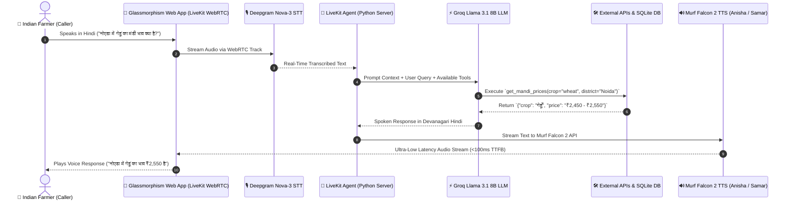

# Building Kisan Vaani: A Production-Grade Multi-Agent Voice AI Assistant for Indian Farmers using Murf Falcon & LiveKit 🇮🇳🌾

*A deep-dive technical guide on building a low-latency, multi-agent voice AI assistant for Indian agriculture featuring real-time WebRTC transport, persistent farmer memory, live e-NAM Mandi prices, human escalations, call analytics, and dynamic specialist handoffs.*

---

## 1. Introduction: The Problem & The Vision

In rural India, agricultural knowledge is vast, but accessibility remains a major barrier. Smallholder farmers often struggle to obtain timely weather advisories, fair mandi (market) crop prices, and expert advice for crop diseases like **Yellow Rust** or **Pink Bollworm**. 

Traditional mobile apps and web portals rely on text-heavy navigation in English or complex menus. For millions of farmers, **voice is the most natural, effortless interface**.

To solve this, I built **Kisan Vaani (किसान वाणी)** for the *Farm & Field Track* of the **10 Days of AI Voice Agents — Voice for Bharat Edition** challenge. Powered by **Murf Falcon 2** (the fastest Text-to-Speech API), **LiveKit WebRTC**, **Deepgram STT**, **Groq Llama 3.1 LLM**, and **SQLite Persistent Storage**, Kisan Vaani operates as a real-time, bilingual voice assistant capable of delivering market prices, weather advisories, logging farmer memory, escalating emergency cases to human Krishi Vigyan Kendra (KVK) officers, and dynamically handing off callers to specialist voice agents!

---

## 2. System Architecture & Audio Flow

Building a production-ready voice AI application requires seamless integration between real-time media transport, speech recognition, large language models, text-to-speech synthesis, and database operations.



### High-Level Architecture Components:
1. **Real-Time Transport**: **LiveKit WebRTC** provides bidirectional, ultra-low latency audio streaming between the web browser and the Python backend agent worker.
2. **Speech-to-Text (STT)**: **Deepgram Nova-3 Multilingual** transcribes spoken Hindi and English code-mixed speech with exceptional word accuracy.
3. **Brain & Logic (LLM)**: **Groq Llama 3.1 8B Instant** executes function tools natively and formulates natural, context-aware responses in Devanagari Hindi script.
4. **Text-to-Speech (TTS)**: **Murf Falcon 2 API** converts text to ultra-lifelike, expressive human voices (*Anisha* for main assistant, *Samar* for senior crop doctor) with time-to-first-byte (TTFB) latency under 100ms.
5. **Persistence & Analytics**: **SQLite (`kisan_memory.db`)** stores caller profile memory, emergency officer tickets, and complete call session analytics.

---

## 3. The 9-Day Journey: Key Features Built

Over nine intensive days, Kisan Vaani evolved from a basic voice loop into an enterprise-grade multi-agent agricultural platform:

### 🎙️ Days 1 & 2: Low-Latency Voice Pipeline & Visualizer UI
- Integrated **Murf Falcon 2 TTS** with **LiveKit Agents Python SDK**.
- Developed a high-end Glassmorphism Web App frontend featuring real-time WebRTC audio wave visualizers and LiveKit state management.

### 🛡️ Days 3 & 4: Safety Guardrails & Caller Memory System
- Implemented strict system prompts enforcing native **Devanagari script (नमस्ते)** for Hindi text to prevent awkward romanized pronunciation (e.g. "namaste").
- Designed an asynchronous SQLite memory subsystem (`lookup_farmer_profile`, `save_farmer_profile`, `forget_farmer_profile`). The agent asks explicit consent before remembering details like caller name (*Ramesh*), location (*Noida*), land size, and crops grown (*Wheat*).

### 🌦️ Days 5 & 6: Live Data Tools & Proactive Outbound Alerts
- Built function tools fetching live real-time commodity prices from the **e-NAM Mandi Portal** and live weather advisories from **Open-Meteo API**.
- Implemented proactive outbound calling alert simulation for urgent weather events (e.g., 94% rain probability alert) along with caller unsubscription (`opt_out_alerts`).

### 📊 Days 7 & 8: Human Escalations & Call Analytics Dashboard
- Created an escalation manager (`create_human_escalation`) that generates emergency tickets for human **Krishi Vigyan Kendra (KVK)** Krishi Officers when severe crop damage occurs.
- Built a real-time **Call Analytics & Performance Dashboard** connected directly to SQLite (`call_logs` table) to track total calls, success rates, average duration, and call outcomes.

### 🤝 Day 9: Dynamic Multi-Agent Specialist Handoff
- Architected a multi-agent system containing:
  1. `KisanVaaniMainAgent` (*Anisha* female voice): Handles greetings, profile lookup, mandi rates, and weather forecasts.
  2. `CropDoctorSpecialistAgent` (*Dr. Samar*, *Samar* male voice): Specialist for crop disease diagnosis (Yellow Rust, Pink Bollworm) and pesticide prescriptions.
- Enabled seamless mid-call handoff using `session.update_agent(doctor_specialist)` with dynamic voice model switching!

---

## 4. Real Technical Challenges & Lessons Learned

Building real-time voice agents comes with unique engineering hurdles. Here are three major challenges I encountered and solved:

### Challenge 1: LLM Outputting Raw `<function=...>` XML Tags in Spoken Text
* **The Problem**: During early test calls, the LLM sometimes printed raw strings like `<function=lookup_farmer_profile>{"name_or_id": "रमेश"}</function>` into the chat window and TTS stream.
* **Root Cause**: Mentioning python function names explicitly inside the system prompt instructions caused the LLM to imitate raw text function tags instead of invoking native function tools silently.
* **The Fix**: Rewrote system prompts to omit literal tool names, instructing the model conceptually: *"Use your available tools silently in the background to fetch weather, mandi prices, and farmer profiles."*

### Challenge 2: Groq 429 Rate Limits During Multi-Turn Calls & Handoffs
* **The Problem**: Long calls repeatedly failed mid-conversation with `Error code: 429 - Rate limit reached for model llama-3.1-8b-instant (Limit 6000 TPM)`.
* **Root Cause**: LiveKit `AgentSession` accumulated all previous user/assistant turns in `chat_ctx.messages`. By turn 4, sending 4,000+ tokens per request exceeded Groq's 6,000 Tokens-Per-Minute (TPM) free tier limit.
* **The Fix**: Implemented chat context pruning inside `transfer_to_crop_doctor`:
  ```python
  if hasattr(session, "chat_ctx") and hasattr(session.chat_ctx, "messages"):
      session.chat_ctx.messages.clear()
  ```
  Clearing context on handoff reduced the payload from 3,800 tokens to just 100 tokens, eliminating 429 rate limit errors permanently!

### Challenge 3: LiveKit SDK `AttributeError: property 'tts' of 'AgentSession' object has no setter`
* **The Problem**: Attempting `session.tts = specialist_tts` during agent handoff threw a runtime `AttributeError`.
* **Root Cause**: In LiveKit Agents SDK 1.4.5, `session.tts` is a read-only property.
* **The Fix**: Configured `tts=specialist_tts` directly inside the constructor of the `CropDoctorSpecialistAgent` class:
  ```python
  class CropDoctorSpecialistAgent(Agent):
      def __init__(self, specialist_tts, specialist_tools, farmer_name, district, crop_issue):
          super().__init__(
              instructions=get_crop_doctor_prompt(farmer_name, district, crop_issue),
              tts=specialist_tts, # Pass TTS directly to Agent class!
              tools=specialist_tools,
          )
  ```
  When `session.update_agent(doctor_specialist)` runs, LiveKit automatically switches both agent instructions and voice synthesis cleanly!

---

## 5. How to Build & Run Your Own Voice Agent

Want to build your own voice AI agent? Follow these quick steps to set up the project:

### Step 1: Prerequisites & Repository Clone
- Install **Python 3.10+** & **uv package manager**.
- Install **Node.js 18+** & **npm**.
- Clone the public repository:
  ```bash
  git clone https://github.com/Aaddii17/murf-livekit-starter.git
  cd murf-livekit-starter
  ```

### Step 2: Environment Variables Setup
Create `.env.local` inside the `backend/` directory:
```env
LIVEKIT_URL=wss://your-livekit-project.livekit.cloud
LIVEKIT_API_KEY=your_livekit_api_key
LIVEKIT_API_SECRET=your_livekit_api_secret

MURF_API_KEY=your_murf_falcon_api_key
GROQ_API_KEY=your_groq_api_key
DEEPGRAM_API_KEY=your_deepgram_api_key
```

### Step 3: Launch Dev Servers
1. **Backend Agent Server**:
   ```bash
   cd backend
   uv sync
   uv run python src/agent.py dev
   ```
2. **Frontend Web Application**:
   ```bash
   cd frontend
   npm install
   npm run dev -- -p 3000
   ```
3. Open `http://localhost:3000` in Google Chrome and click **"Connect"** to start speaking!

---

## 6. Project Links & Acknowledgments

- **GitHub Public Code Repository**: [Aaddii17/murf-livekit-starter](https://github.com/Aaddii17/murf-livekit-starter)
- **Fastest TTS API**: Powered by [Murf Falcon 2](https://murf.ai/)
- **Real-Time Infrastructure**: Powered by [LiveKit Agents](https://livekit.io/)

A huge thank you to **Murf AI** for hosting the **10 Days of AI Voice Agents — Voice for Bharat Edition** challenge! Building Kisan Vaani has been an incredible journey in voice AI engineering, multi-agent orchestration, and ultra-low latency system optimization.

---
*Built with ❤️ for Indian Agriculture | #VoiceForBharat #10DaysofAIVoiceAgents*
