# How I Built Kisan Vaani: A Multi-Agent Voice AI Assistant for Indian Farmers

Over the last 10 days, I participated in the **10 Days of AI Voice Agents (Voice for Bharat Edition)** challenge by Murf AI. My goal was to build a real-world voice application that solves an actual problem in India.

I chose the **Farm & Field Track** and built **Kisan Vaani (किसान वाणी)** — an AI-powered voice assistant designed to help Indian farmers get instant market prices, weather updates, and agricultural doctor advice through natural Hindi voice calls.

Here is a breakdown of what I built, the architecture behind it, the hardest bugs I ran into, and how you can run the project yourself.

---

## The Problem I Set Out to Solve

In rural India, most agricultural information is locked behind text-heavy websites or mobile apps. For many farmers, navigating complex menus or reading long texts in smartphones is a major barrier. 

When a farmer needs to know today's **mandi price for wheat in Noida**, or needs urgent medicine advice for **Yellow Rust disease** on their crop, a 30-second voice call in native Devanagari Hindi is much more natural and effective than searching through an app.

I designed Kisan Vaani to act like a personal phone call helper:
1. It greets farmers in natural Devanagari Hindi.
2. It looks up live Mandi commodity prices and weather forecasts.
3. It remembers previous caller profile information across calls using SQLite.
4. If the farmer reports a severe crop disease, it transfers the caller mid-session to a Specialist Crop Doctor Agent (*Dr. Samar*) who speaks in a dedicated male doctor voice.

---

## System Architecture

Here is how real-time audio and data flow through the application:

```mermaid
flowchart TD
    Browser["Next.js Web Frontend & Audio Visualizer"] <-->|WebRTC Stream| LiveKit["LiveKit WebRTC Cloud"]
    LiveKit <--> STT["Deepgram Nova-3 Speech-to-Text"]
    LiveKit <--> TTS1["Murf Falcon 2 TTS ('Anisha' Main Voice)"]
    LiveKit <--> TTS2["Murf Falcon 2 TTS ('Samar' Doctor Voice)"]
    
    subgraph Agent Engine ["Python Agent Backend"]
        MainAgent["KisanVaaniMainAgent"]
        SpecAgent["CropDoctorSpecialistAgent"]
        LLM["Groq Llama 3.1 LLM"]
    end

    STT --> MainAgent
    MainAgent <--> LLM
    MainAgent -->|Agent Transfer| SpecAgent
    MainAgent --> TTS1
    SpecAgent --> TTS2

    subgraph Storage ["SQLite Database"]
        DB1[("farmers table")]
        DB2[("escalations table")]
        DB3[("call_logs table")]
    end

    MainAgent <--> Storage
```



### The Tech Stack
- **Voice Synthesis (TTS)**: Murf Falcon 2 (ultra-low latency <100ms TTFB)
- **Real-Time Transport**: LiveKit Agents SDK & WebRTC Cloud
- **Speech Recognition (STT)**: Deepgram Nova-3 Multilingual
- **Language Model (LLM)**: Groq Llama 3.1 8B Instant
- **Database**: SQLite (`kisan_memory.db`)
- **Frontend**: Next.js 15, React, Tailwind CSS

---

## Key Features Built Over the 10 Days

### 1. Natural Hindi Voice with Ultra-Low Latency
Using **Murf Falcon 2** (`Anisha` voice), the agent responds almost instantly with a Time-to-First-Byte under 100ms. The voice sounds warm and natural, making the conversation feel like talking to a real helper on the phone.

### 2. Caller Profile Memory (SQLite)
Instead of asking for information repeatedly, Kisan Vaani remembers the farmer across calls. When Ramesh from Noida calls back, the agent loads his saved profile from the `farmers` SQLite table and tailors its responses to his location and crop.

### 3. Live Mandi Prices & Weather Alerts
I integrated real-time tools to fetch current market prices per quintal for crops like Wheat, Paddy, and Mustard (via e-NAM price data), as well as district weather forecasts and rain probabilities (via Open-Meteo API).

### 4. Human Escalation & Call Analytics Dashboard
If a farmer faces an emergency or financial dispute, Kisan Vaani creates an escalation ticket in SQLite (`escalations` table) for a Krishi Vigyan Kendra (KVK) officer callback. All call outcomes, duration metrics, and success rates are rendered on a glassmorphism dashboard built with Next.js.

### 5. Multi-Agent Specialist Handoff
When a farmer asks about crop diseases like Yellow Rust, the main agent (*Anisha*) announces a transfer: *"I am connecting you with our senior crop doctor specialist."*
The session updates to `CropDoctorSpecialistAgent`, and the TTS voice dynamically switches to Murf Falcon **Samar** (a male doctor voice), who provides precise pesticide treatment remedies.

---

## Real Engineering Challenges & How I Solved Them

Building real-time voice agents comes with unique edge cases. Here are the three main technical hurdles I worked through:

### 1. Stopping the LLM from Speaking Raw Tool Tags
Early in testing, Llama 3.1 occasionally outputted text tags like `<function=lookup_farmer_profile>{"name_or_id": "रमेश"}</function>` directly into the chat box.

**The Cause**: Mentioning literal python function names inside the prompt text tricked the LLM into thinking it should output them as text instead of executing native background tools.

**The Fix**: I removed all literal function names from the prompt text and added strict rules ordering the LLM to run background tools silently without outputting code tags.

### 2. Overcoming Groq 429 Rate Limits During Agent Transfers
During multi-turn calls, Groq returned 429 Token-Per-Minute rate limit errors.

**The Cause**: The accumulated conversation history sent to Groq grew too large on long calls.

**The Fix**: When transferring the caller to the specialist doctor, I cleared the old chat context (`session.chat_ctx.messages.clear()`). This dropped the request payload back down to ~100 tokens, completely eliminating 429 rate limit errors.

### 3. Fixing LiveKit Read-Only Property Error
Attempting `session.tts = specialist_tts` inside the handoff tool threw an `AttributeError` because `session.tts` is read-only in LiveKit Agents 1.4.5.

**The Fix**: I passed the TTS instance directly into the agent class constructor:

```python
class CropDoctorSpecialistAgent(Agent):
    def __init__(self, specialist_tts, specialist_tools: list, farmer_name: str, district: str, crop_issue: str):
        super().__init__(
            instructions=get_crop_doctor_prompt(farmer_name, district, crop_issue),
            tts=specialist_tts,
            tools=specialist_tools,
        )
```

Now when `session.update_agent(doctor_specialist)` runs, LiveKit automatically updates both the agent logic and the Murf Falcon voice seamlessly.

---

## How to Set Up and Run Kisan Vaani

If you want to run this project on your local machine, follow these steps:

### 1. Clone the Code
```bash
git clone https://github.com/Aaddii17/murf-livekit-starter.git
cd murf-livekit-starter
```

### 2. Install Dependencies
```bash
# Backend setup
cd backend
uv venv
uv sync

# Frontend setup
cd ../frontend
npm install
```

### 3. Configure API Keys
Create a `.env.local` file in both `backend` and `frontend` folders with your credentials:
```env
LIVEKIT_URL=wss://your-project.livekit.cloud
LIVEKIT_API_KEY=your_livekit_key
LIVEKIT_API_SECRET=your_livekit_secret
MURF_API_KEY=your_murf_key
DEEPGRAM_API_KEY=your_deepgram_key
GROQ_API_KEY=your_groq_key
```

### 4. Launch the Dev Servers
```bash
# Terminal 1 (Python Agent)
cd backend
uv run python src/agent.py dev

# Terminal 2 (Next.js Dashboard)
cd frontend
npm run dev -- -p 3000
```

Open `http://localhost:3000` in your browser to start talking with Kisan Vaani!

---

## Conclusion & Code Links

Building Kisan Vaani showed me how powerful combining WebRTC, fast TTS, and multi-agent LLM systems can be for solving accessibility problems in India.

- **GitHub Repository**: [Aaddii17/murf-livekit-starter](https://github.com/Aaddii17/murf-livekit-starter)
- **LiveKit Agents Framework**: [LiveKit Voice AI Docs](https://docs.livekit.io/agents/start/voice-ai/)
- **Murf Falcon Documentation**: [Murf Falcon 2 Docs](https://murf.ai/api/docs/text-to-speech-models/falcon-2)

Thanks to Murf AI for hosting the **#VoiceForBharat** challenge!
