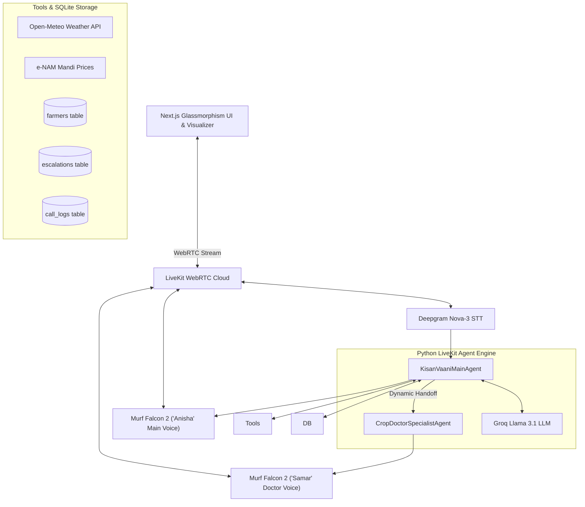

# 🌾 Kisan Vaani (किसान वाणी) — Multi-Agent AI Voice Assistant for Indian Farmers 🇮🇳

[](https://murf.ai)
[](https://livekit.io)
[](https://deepgram.com)
[](https://groq.com)
[](LICENSE)

**Kisan Vaani** is a real-time, multi-agent AI voice assistant built for Indian farmers as part of the **10 Days of AI Voice Agents — Voice for Bharat Edition** challenge.

It delivers natural Devanagari Hindi conversations with ultra-low speech latency (<100ms TTFB), persistent caller memory in SQLite, real-time e-NAM Mandi prices, localized weather forecasts, Krishi Vigyan Kendra (KVK) officer escalations, glassmorphism analytics dashboard, and dynamic multi-agent handoff to specialist crop doctors.

---

## 🏗️ System Architecture



---

## 🌟 Key Features

1. **🎙️ Ultra-Fast Indian Voice Pipeline**: Powered by **Murf Falcon 2** (`Anisha` voice) with TTFB latency <100ms.
2. **🧠 Devanagari Guardrails & SQLite Memory**: Enforces native Devanagari Hindi (नमस्ते) and persists farmer profile facts (`farmers` table).
3. **🌦️ Live Weather & e-NAM Mandi Prices**: Real-time district weather forecasts (Open-Meteo API) and commodity rates per quintal.
4. **🚨 Outbound Call Alerts & Opt-Out**: Proactive emergency alerts with unsubscription management (`opt_out_alerts`).
5. **☎️ KVK Human Officer Escalations**: Emergency ticket logging in SQLite (`escalations` table) for severe crop disease callback.
6. **📊 Call Analytics Dashboard**: Next.js dashboard featuring live metrics (Total Calls, Success Rate %, Avg Duration) and SQLite call logs table (`call_logs`).
7. **🤝 Multi-Agent Specialist Handoff**: Seamless transition from general assistant (*Anisha*) to Senior Crop Doctor (*Dr. Samar* with Murf Falcon male voice *Samar*).

---

## 🚀 Getting Started

### 1. Prerequisites
- Python 3.10+
- Node.js 18+
- API Keys: LiveKit Cloud, Murf AI, Deepgram, Groq

### 2. Installation & Environment Setup

```bash
git clone https://github.com/Aaddii17/murf-livekit-starter.git
cd murf-livekit-starter

# Backend Setup
cd backend
uv venv
uv sync

# Frontend Setup
cd ../frontend
npm install
```

Create `.env.local` in `backend` and `frontend`:
```env
LIVEKIT_URL=wss://your-project.livekit.cloud
LIVEKIT_API_KEY=your_key
LIVEKIT_API_SECRET=your_secret
MURF_API_KEY=your_murf_key
DEEPGRAM_API_KEY=your_deepgram_key
GROQ_API_KEY=your_groq_key
```

### 3. Run Locally

```bash
# Terminal 1: Backend Agent Server
cd backend
uv run python src/agent.py dev

# Terminal 2: Frontend Dashboard (Port 3000)
cd frontend
npm run dev -- -p 3000
```
Open **`http://localhost:3000`** in your browser.

---

## 📝 Challenge & Blog Link

- **Published Technical Blog Post**: [DAY10_BLOG_POST.md](DAY10_BLOG_POST.md)
- **Built for**: 10 Days of AI Voice Agents — Voice for Bharat Edition by **Murf AI**.
