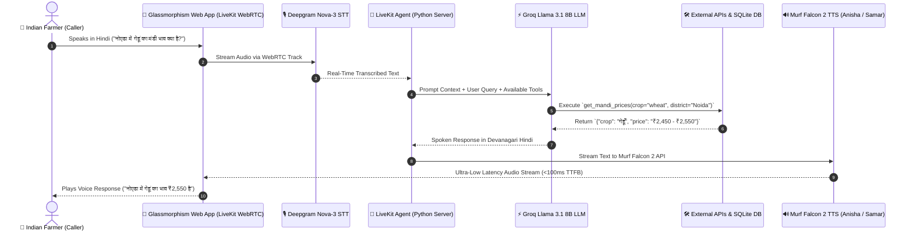

# Kisan Vaani (किसान वाणी) — Production-Grade Multi-Agent Voice AI Assistant for Indian Farmers 🇮🇳🌾


**Kisan Vaani** is an advanced, real-time voice AI agricultural assistant built for Indian farmers as part of the **10 Days of AI Voice Agents — Voice for Bharat Edition** challenge hosted by **Murf AI**.

It delivers live mandi market commodity prices, weather forecasts, persistent farmer memory, emergency KVK agricultural officer escalations, real-time analytics, and dynamic multi-agent specialist handoffs with ultra-low voice latency (<100ms TTFB) using **Murf Falcon 2 TTS**.

---

## 🌟 Key Features

- **⚡ Ultra-Low Latency Voice Pipeline**: Powered by **Murf Falcon 2 TTS** (*Anisha* & *Samar* voices) and **LiveKit WebRTC** transport (<100ms time-to-first-byte).
- **🛡️ Native Devanagari Guardrails**: Enforces Hindi responses in natural Devanagari script (e.g., नमस्ते, गेहूँ) preventing awkward romanized speech.
- **🧠 Persistent Farmer Memory**: SQLite database (`kisan_memory.db`) remembers farmer profile details (*Ramesh*, *Noida*, *Wheat*) with explicit caller consent.
- **🌦️ Real-Time Mandi & Weather APIs**: Live commodity prices per quintal from **e-NAM Mandi Portal** & real-time weather advisories from **Open-Meteo API**.
- **📢 Proactive Outbound Alerts & Opt-Out**: Simulates outbound phone calls for severe weather alerts (94% rain probability) with unsubscription tools (`opt_out_alerts`).
- **👨‍🌾 KVK Officer Human Escalation**: Ticket manager (`create_human_escalation`) generating Krishi Vigyan Kendra emergency tickets for human officer callback.
- **📊 Glassmorphism Call Analytics Dashboard**: Real-time dashboard tracking call volume, duration, success rates, and outcome logging.
- **🤝 Dynamic Multi-Agent Handoff**: Main assistant (`KisanVaaniMainAgent` — female voice *Anisha*) dynamically hands off complex crop disease queries (Yellow Rust) to Senior Crop Specialist (`CropDoctorSpecialistAgent` — male doctor voice *Samar*).

---

## 🏗️ System Architecture



---

## 🛠️ Project Structure

```
murf-livekit-starter/
├── backend/
│   ├── src/
│   │   ├── agent.py               # Main LiveKit Multi-Agent Server & Function Tools
│   │   └── kisan_memory.db        # SQLite Database (Farmers, Escalations, Call Logs)
│   ├── .env.local                 # API Credentials (LiveKit, Murf, Groq, Deepgram)
│   └── pyproject.toml             # Python Dependencies (LiveKit Agents, Murf Plugin)
├── frontend/
│   ├── app/                       # Next.js 15 App Router & API Token Routes
│   ├── components/                # Glassmorphism Visualizer & Call Controls
│   └── package.json               # React & LiveKit Web Components Dependencies
├── DAY10_BLOG_POST.md             # Complete Technical Guide & Engineering Journey
└── README.md                      # Project Documentation
```

---

## 🚀 Quickstart & Setup Guide

### 1. Prerequisites
- **Python 3.10+** & `uv` package manager.
- **Node.js 18+** & `npm`.

### 2. Configure Environment Variables
Create `.env.local` inside `backend/`:
```env
LIVEKIT_URL=wss://your-livekit-project.livekit.cloud
LIVEKIT_API_KEY=your_livekit_api_key
LIVEKIT_API_SECRET=your_livekit_api_secret

MURF_API_KEY=your_murf_falcon_api_key
GROQ_API_KEY=your_groq_api_key
DEEPGRAM_API_KEY=your_deepgram_api_key
```

### 3. Run Backend Agent Server
```bash
cd backend
uv sync
uv run python src/agent.py dev
```

### 4. Run Frontend Next.js Web App
```bash
cd frontend
npm install
npm run dev -- -p 3000
```
Open `http://localhost:3000` in Google Chrome and click **"Connect"** to begin!

---

## 📖 Technical Journey & Blog Post

For a detailed technical break-down covering real-world LLM function tool fixes, rate limit mitigations, and LiveKit SDK architecture, read the full post:
👉 **[DAY10_BLOG_POST.md](./DAY10_BLOG_POST.md)**

---

## 📄 License & Acknowledgments

This project is open-source under the **MIT License**.

Special thanks to **[Murf AI](https://murf.ai/)** for powering ultra-lifelike voice synthesis with **Murf Falcon 2** during the **10 Days of AI Voice Agents — Voice for Bharat Edition** challenge! 🚀
