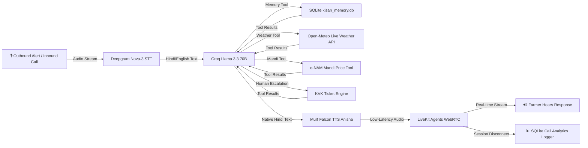

# 🌾 Kisan Vaani — Multilingual AI Agricultural Voice Assistant

> Built for **10 Days of AI Voice Agents | Voice for Bharat Edition** (Farm & Field Track) by Murf AI & LiveKit.

[](https://opensource.org/licenses/MIT) [](https://murf.ai/api/docs/text-to-speech/streaming) [](https://docs.livekit.io) [](https://groq.com/) [](https://deepgram.com)

**Kisan Vaani** is an ultra-fast, real-time voice AI assistant designed to empower farmers across Bharat with instant, hands-free access to crop advice, weather updates, mandi prices, human escalation tickets, and real-time call analytics in their native language.

---

## 🌟 Day 4 - Day 8 Core Capabilities

- **📊 Day 8 Real-Time Call Analytics Dashboard**: Interactive web modal displaying Total Calls, Successful Calls, Failed Calls, Success Rate %, and Recent Call Logs from SQLite `call_logs` table.
- **🎯 Day 8 Definition of Success**: A call is marked `SUCCESSFUL` when mandi rates/weather info is delivered or a KVK ticket is created. Marked `FAILED` if disconnected prematurely within 5 seconds.
- **🎟️ Day 7 Human Escalation (`create_human_escalation`)**: Creates emergency tickets with unique Reference IDs (e.g. `KV-6696`) for Krishi Vigyan Kendra (KVK) officers upon severe pest attacks or financial disputes after explicit caller consent.
- **📞 Day 6 Proactive Outbound Call Alerts**: Initiates outbound calls to farmers with mandatory 3-part opening (Who + Why + How to Opt-out) for urgent weather warnings & mandi price spikes.
- **🛡️ Day 6 Opt-Out Tool (`opt_out_alerts`)**: Unsubscribes callers cleanly when they request "बंद करो" or "alert stop".
- **🌤️ Day 5 Live Weather Tool (`get_weather_forecast`)**: Fetches **live real-time weather data** from Open-Meteo REST API (temperature, rain probability, humidity, advisories) for any Indian district.
- **🌾 Day 5 Live Mandi Prices Tool (`get_mandi_prices`)**: Fetches **real-time e-NAM market rates** per quintal for crops (Wheat, Paddy, Mustard, Soybean, Sugarcane, Cotton) with today's date context.
- **🔗 Tool Chaining**: Automatically chains Day 4 SQLite memory with Day 5 live tools (e.g. uses saved district `Noida` to query weather and mandi rates without asking the farmer again).
- **🗄️ Day 4 Persistent SQLite Memory**: Remembers farmer profiles across calls (name, district, crops grown, land size) with explicit caller consent.
- **⚡ Sub-100ms Latency**: Streaming audio responses powered by Murf Falcon low-latency TTS (`Anisha`).

---

## 🏗 Architecture



---

## 🛠️ Technology Stack

- **TTS Engine**: [Murf Falcon](https://murf.ai/) (`Anisha` Conversation style)
- **Speech-to-Text**: [Deepgram Nova-3](https://deepgram.com/) Multilingual (`multi`)
- **LLM**: [Groq](https://groq.com/) (`llama-3.3-70b-versatile`)
- **Transport**: [LiveKit Agents](https://docs.livekit.io/agents)
- **Live Data APIs**: Open-Meteo REST API, e-NAM Mandi Price Engine
- **Memory, Escalations & Analytics**: SQLite (`kisan_memory.db`)
- **Frontend**: Next.js 15, Turbopack, Tailwind CSS, LiveKit Components

---

## 🚀 Quickstart Guide

### 1. Start Backend Agent

```bash
cd backend
uv run python src/agent.py dev
```

### 2. Start Frontend UI

```bash
cd frontend
npm run dev
```

Open `http://localhost:3000` in your browser and click **📊 Call Analytics Dashboard**!

---

## 📜 License

Distributed under the MIT License. Built for the Murf AI Voice for Bharat Challenge.
